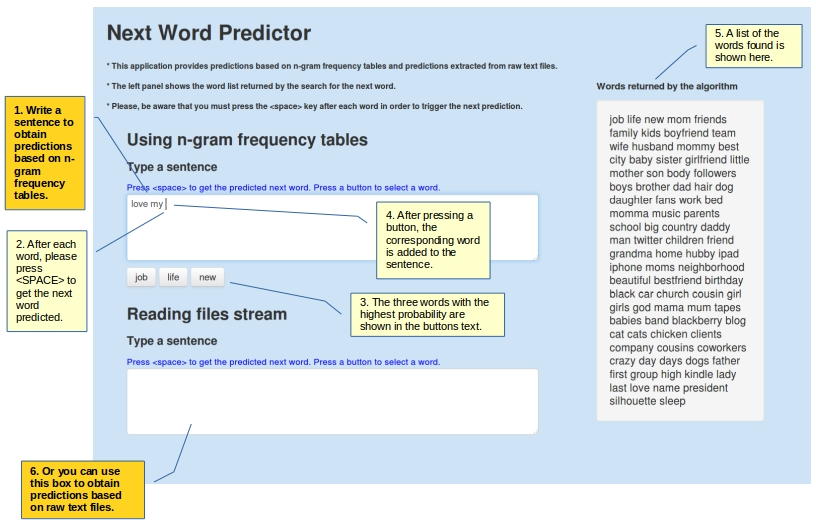

Next Word Predictor
========================================================

Working with n-gram frequency tables and raw file streams  
Maria Bravo  
December 2014  

Two approaches implemented in the Predictor application
================================================================
<small>
***Approach A:***: Builds n-grams tables over cleaned text files and executes searches into the weighted frequencies of grams following the back-off algorithm.
- Using the tm and RWeka libraries, five n-gram tables have been generated (1-gram to 5-gram).
- The cleaning process first script batch run on the raw text files before the n-gram tables were generated. In a second stage, a dictionary of invalid words was created by analyzing frequencies and strange characters in the n-gram tables, and working with the Python enchant spellchecking library. A second batch cleaned the n-gram tables using the invalid words dictionary.
- The back-off algorithm has been extended to look for wider words combinations:  
e.g. "love [any word] my [any word]  family" 

Searching into raw unprocessed text files
========================================================
***Approach B***: Looks into unprocessed text files cropped to fit resources availability. This approach searches on the fly entire paragraphs using regular expressions. Example: <small>  

sentence: "love my family"  
regexp: ".{0,1}\\blove\\b.{0,1}\\bmy\\b.{0,1}\\bfamily\\b"  

Where {0,1} are evaluated parameters used to tune the distance between the sentence words when the algorithm is looking into the file paragraphs.  

The algorithm would be able to return (***according to the raw files content***), paragraphs weighted on degrees of separation (DS) between the grams we are searching for:  
- I love my family to bits DS = 0   
- I love deeply my extended family and my friends DS = 2 
- She would love to help you but my sister's job is too demanding and the Simpsons family is coming to dinner DS = 12 

</small> 
<h6 align="left">
 

</h6>
</small>   

How to use the application?
========================================================
[Click here to start the app](https://mbravo.shinyapps.io/PredictorApp/)

Stopping the sea tides with a blanket?
======================================
<small> <small>
- Language is alive and change is always coming. We can not build orthodox solutions, based on static structures as dictionaries, aimed to satisfy evolving requirements. Who will decide which words should be filtered?. What is a foreign word in the global village?. Twitter is teaching us better. Graphic symbols as emoticons belong to the language in use. Excluding stop words? According to the n-gram files built for this project the word "the" represents more than 6% of the entire English corpus.

- The scanning of raw text files implemented in the second algorithm provides a more efficient solution to the word prediction problem. A corpora feeding on real-time data stream will be able to deliver answers fitted to the timeline. About statistical evidence, because of time restrictions the test scripts (coded in Python) have not been finished. But the running application shows the difference between both approaches.  

Disclaimer:  Please, forgive my newbie technical mistakes and my struggling with semantics and grammar. English is my second language and this is my first NLP experiment. Thanks to the Community TA's and the wonderful people sharing their expertise at the Discussion forums. I have shamelessly plagiarized any good idea I found there. Thanks!
</small>
</small>

